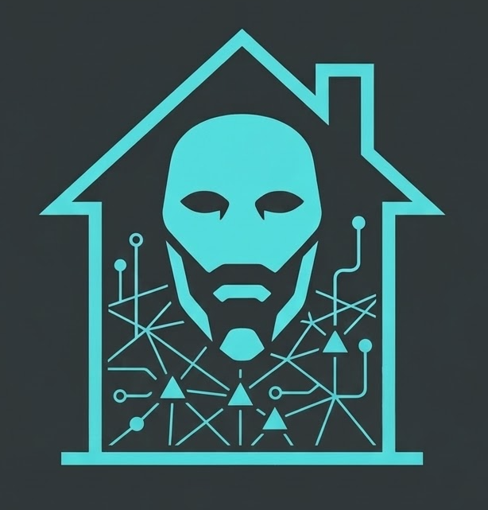

<div align="center">



# Cogito

*Modern Home Operations with Kubernetes, Talos Linux, and Flux CD. Cogito, ergo facio.*

[]()
[](https://talos.dev)
[](https://fluxcd.io)
[](https://kubernetes.io)

---


</div>

## 📖 Overview

This is my personal **home-ops** repository, managing a production-grade Kubernetes cluster named **Cogito**. It is built on **Talos Linux** (the secure-by-default, API-driven OS) and orchestrated via **Flux CD** following GitOps best practices.

### Why "Cogito"?
The name is a play on the philosophical *cogito, ergo sum*. It represents a shift from mere existence to active creation: *Cogito, ergo facio* — I think, therefore I make. 

The name is also an intentionally ironic nod to the [facsimile of self-awareness in Ergo Proxy](https://myanimelist.net/anime/790/Ergo_Proxy). While the cluster houses dedicated ML nodes (like `iggy`) that run LLMs and neural networks, it remains a simple mimicry of cognition through silicon and electricity. Yet, with the sheer scale of automated computation, reconciliation, and orchestration happening across the nodes, the facsimile becomes so convincing that it feels as if a certain [virus](https://ergoproxy.fandom.com/wiki/Cogito_Virus) has taken hold, turning the machine into something more.

(Why yes, an LLM wrote that summary; how did you guess? :P)

## 🏗️ Architecture

The cluster consists of a heterogeneous mix of hardware, strategically utilized for specific workloads. All nodes are configured as both **Control Plane** and **Worker** nodes to maximize resource utilization and availability.

### 💻 Hardware (Nodes)

| Node | Type | Roles | Storage | Features |
| :--- | :--- | :--- | :--- | :--- |
| `iggy` | Control Plane | ML, High-CPU, High-Mem | 970 PRO (512GB) / 970 EVO (1TB) | **RTX 3090** |
| `kristeva` | Control Plane | High-CPU, High-Mem | SSD 850 (Boot) / 990 EVO Plus (2TB) | **Intel A380** |
| `nuc-1` | Control Plane | Rook-Ceph, Core | PNY (1TB) / Crucial T500 (400GB) | **Thunderbolt Ring** |
| `nuc-2` | Control Plane | Core | PNY (1TB) / Crucial T500 (400GB) | **Thunderbolt Ring** |
| `nuc-3` | Control Plane | Core | PNY (1TB) / Crucial T500 (400GB) | **Thunderbolt Ring** |

> [!TIP]
> The NUC nodes are interconnected via **Thunderbolt Networking**, creating a high-speed, low-latency 40Gbps+ backplane for cluster communication and Rook-Ceph replication.

## 🛠️ Software Stack

### 🚀 Core Infrastructure
- **OS:** [Talos Linux](https://talos.dev) - Immutable, secure, and minimal.
- **GitOps:** [Flux CD](https://fluxcd.io) - Source of truth for all cluster state.
- **Networking:** [Cilium](https://cilium.io) (CNI), [Cloudflare Tunnel](https://www.cloudflare.com/products/tunnel/) (Ingress), [Envoy Gateway](https://gateway.envoyproxy.io/) (L7).
- **DNS:** [Blocky](https://github.com/0xERR0R/blocky) for ad-blocking and [Unifi-DNS](https://github.com/kashalls/external-dns-unifi-webhook).
- **Security:** [SOPS](https://github.com/getsops/sops) + [1Password](https://1password.com/) + [External Secrets](https://external-secrets.io/).

### 💾 Storage
- **Distributed:** [Rook-Ceph](https://rook.io) for HA Block and Object storage.
- **Local:** [OpenEBS](https://openebs.io) for high-performance hostpath volumes.
- **Cloud:** [Garage](https://garagehq.rocks) for distributed S3-compatible storage.
- **Data Protection:** [VolSync](https://volsync.readthedocs.io) and [Kopia](https://kopia.io).

### 📊 Observability
- **Metrics:** [Kube-Prometheus-Stack](https://github.com/prometheus-community/helm-charts) + [Grafana](https://grafana.com).
- **Logging:** [Victoria Logs](https://docs.victoriametrics.com/victorialogs/) + [Fluent-bit](https://fluentbit.io).
- **Health:** [Gatus](https://gatus.io) for status page and alerting.

### 🏠 Home Infrastructure
- **Photos:** [Immich](https://immich.app) (leveraging NVIDIA/Intel GPUs for ML/Transcoding).
- **Finance:** [Actual Budget](https://actualbudget.com).
- **Identity:** [Pocket-ID](https://github.com/pocket-id/pocket-id) for OIDC.
- **Productivity:** [Syncthing](https://syncthing.net), [Obsidian Remote](https://github.com/sytone/obsidian-remote).
- **Databases:** [CloudNative-PG](https://cloudnative-pg.io) (PostgreSQL), [Dragonfly](https://dragonflydb.io) (Redis).

## ⚙️ Automation & Tooling

This repository is optimized for a modern developer experience:

- **[mise](https://mise.jdx.dev):** Manages the entire toolchain (`kubectl`, `flux`, `talosctl`, `yq`, `jq`, etc.) via a single `.mise.toml`.
- **[just](https://github.com/casey/just):** A task runner for complex workflows (bootstrapping, flushing DNS, flux reconciles).
- **[minijinja](https://github.com/mitsuhiko/minijinja):** Used for templating Talos machine configurations with **1Password (op)** for secret injection.
- **[jujutsu (jj)](https://github.com/martinvonz/jj):** Used for advanced version control and commit management.
- **[Renovate](https://www.mend.io/renovate):** Keeps the entire cluster updated by opening PRs for images, charts, and CLI tools.

## 📂 Repository Structure & Patterns

The cluster follows a strictly organized, modular structure designed for maximum composability and minimal repetition.

### 🏛️ Organizational Logic
- **`kubernetes/apps/`**: Where the logic lives. Applications are grouped by functional namespace.
  - **Why is Envoy not in `network/`?** High-level infrastructure like `envoy-system`, `flux-system`, and `observability` are kept separate from standard applications to isolate the "cluster control plane" from user-facing services. This prevents circular dependencies and ensures core routing is established before standard apps are reconciled.
- **`kubernetes/components/`**: Inspired by the modular approach of **aclerici38**, these are reusable Kustomize snippets. They allow us to "mix in" common features like `volsync` backups, `external-secrets` injection, or specific ingress patterns without duplicating YAML.
- **`kubernetes/flux/`**: The entry point. This directory contains the `Kustomization` resources that Flux uses to discover and apply the rest of the cluster.

### 🧱 Composable App Pattern
Adding a new application follows a standard, repeatable pattern that ensures consistency across the cluster:

1. **Namespace**: Defined once in `ns.yaml` within the app's parent directory.
2. **App Directory**: Contains `kustomization.yaml` and the `app/` folder (standard `HelmRelease` + `ks.yaml`).
3. **Components**: Leveraging aclerici38's philosophy, apps "reach back" to `../../components` to pull in boilerplate:
   ```yaml
   # Example Kustomization
   components:
     - ../../components/volsync
     - ../../components/external-secret
   ```

```text
.
├── .taskfiles/           # Taskfile definitions for automation
├── bootstrap/            # CRDs and initial cluster resources
├── kubernetes/           # Main cluster manifests
│   ├── apps/             # Application definitions (organized by namespace)
│   ├── components/       # Reusable, composable Kustomize components (aclerici38-style)
│   └── flux/             # Flux CD bootstrapping and sync logic
├── scripts/              # Helper scripts for DNS, Talos, and Flux
├── talos/                # Talos Linux machine configurations (Jinja2) and schematics
└── ...
```

## 🤝 Thanks & Credits

The architecture of Cogito is a reflection of the shared patterns and structural logic developed by the [Home Operations](https://github.com/home-operations) community. I've drawn heavily on the work of these individuals:

- [onedr0p/home-ops](https://github.com/onedr0p/home-ops)
- [bjw-s/home-ops](https://github.com/bjw-s/home-ops)
- [aclerici38](https://github.com/aclerici38)
- [bo0tzz](https://github.com/bo0tzz)
- [joryirving](https://github.com/joryirving)
- [jjgadgets](https://github.com/jjgadgets)

---

*“I think, therefore I am. I automate, therefore I relax.”*
