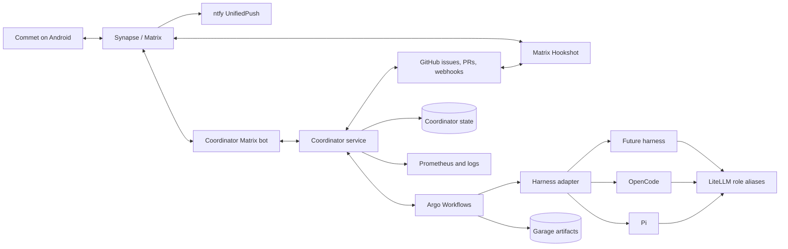
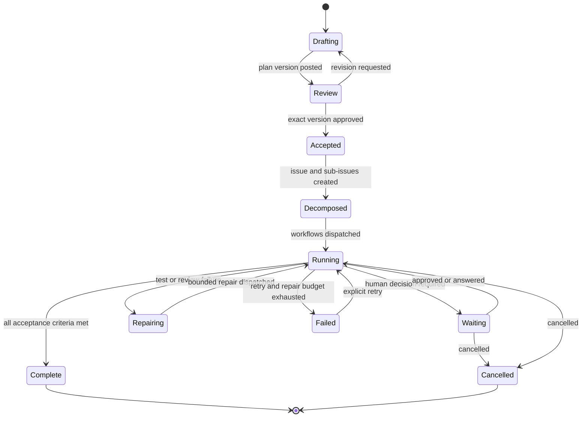

# Matrix development coordination

Status: implementation plan and controlling checklist  
Owner: Tim  
Primary human interface: Commet over Matrix  
Infrastructure source of truth: this repository  

## Purpose

Cogito needs a development workflow that can plan, review, implement, and report
work without coupling the workflow to Pi, OpenCode, or any other agent harness.
The normal human interaction happens in Matrix from Commet. GitHub records
accepted work and code review. Kubernetes runs durable workflows. LiteLLM
provides stable role names whose backing models can change independently.

The existing plan-in-a-pull-request experiment proved the notification and
delivery path, but it placed discussion in the wrong object, required too many
manual transitions, and made Pi both coordinator and executor. This design
replaces that prototype after an end-to-end acceptance run succeeds.

## Decisions

1. **A Matrix thread is the plan-review object.** A planner posts a versioned
   plan to a project-room thread. Tim replies inline, requests revisions, and
   approves an exact version from Commet.
2. **A GitHub issue is the accepted-work object.** Approval creates one parent
   issue containing the immutable accepted plan, acceptance criteria, Matrix
   permalink, and content hash. Deliverables become native GitHub sub-issues.
   Several pull requests may satisfy one issue.
3. **Pull requests contain repository changes only.** They link to the
   applicable issue or sub-issue and retain normal independent review and CI.
4. **The coordinator owns workflow state.** It reconciles Matrix, GitHub, and
   Argo events; decomposes work; dispatches workers; requests reviews; performs
   bounded repairs; and reports status without routine human prompting.
5. **Argo Workflows owns run execution.** Durable workflow state, retries,
   suspension, cancellation, artifacts, and exit handling live in Kubernetes.
6. **Agent harnesses are adapters.** Pi, OpenCode, and later harnesses implement
   one small run contract. A provider or model such as DeepSeek sits behind a
   LiteLLM role alias and is not itself a workflow dependency.
7. **Matrix is the notification source; ntfy is its Android push transport.**
   Direct ntfy publication remains an emergency fallback and outbox, not a
   second workflow state store.
8. **Configuration and policy live in Git.** Credentials live in 1Password and
   enter Kubernetes through External Secrets. Runtime state and audit records
   live in purpose-built stores, with stable links back to Git revisions.

## Source-of-truth boundaries

| Concern | Authoritative system | Durable identifier |
| --- | --- | --- |
| Proposed plan and human review | Matrix project-room thread | room ID + root event ID |
| Approved plan version | Matrix approval event plus GitHub parent issue | SHA-256 content hash |
| Deliverables and milestones | GitHub parent issue, sub-issues, and milestone | issue URLs/node IDs |
| Code changes and review | GitHub pull requests | PR URLs and commit SHAs |
| Desired infrastructure | Cogito Git repository | commit SHA |
| Workflow execution | Argo Workflow CR | namespace/name + run ID |
| Agent result | normalized result artifact | run ID + artifact digest |
| Human alerts and intervention | Matrix alert/run thread | Matrix event ID |
| Android wake-up | ntfy/UnifiedPush | ephemeral push identifier |
| Model routing and spend | LiteLLM role alias and virtual key | role + key identity |

No component infers accepted work from a mutable document or label alone. Every
transition carries the identifiers of the objects on both sides.

## Architecture



Hookshot brings GitHub events into the applicable Matrix thread. The
coordinator bot handles the Cogito-specific plan protocol and commands. These
may initially share a deployment boundary, but their responsibilities remain
separate.

## Matrix information architecture

Rooms represent audiences and durable subjects, not transient processes or
individual agents:

| Room | Use |
| --- | --- |
| `#agent-control` | New requests, commands, concise responses, and approvals |
| `#project-cogito` | One thread per Cogito plan or accepted work item |
| `#agent-plans` | Plans without a dedicated project room |
| `#agent-runs` | One detailed thread per workflow run |
| `#agent-alerts` | Failures, blockers, approval requests, and major completions |
| `#personal-watches` | Durable watch-related context and requests |
| `#personal-money-making` | Durable income-project context and requests |

New projects receive a room only when they have ongoing context or a distinct
audience. New agents do not receive rooms. Short tasks remain threads in their
project or topic room.

### Plan thread protocol

The bot recognizes commands and reactions only from an allowlist of Matrix user
IDs. Each state-changing response includes a transaction ID so retries are
idempotent.

1. A request in a project room creates a plan thread and invokes `planner`.
2. The root event contains a stable plan ID, title, repository, and state.
3. Each plan version is posted as a single canonical Markdown message. Large
   sections may be companion thread messages, but the canonical content and
   hash are unambiguous.
4. Replies or quoted text become review comments. `revise` asks the planner to
   produce the next complete version and a concise change summary.
5. `approve` or the configured approval reaction records the exact event ID,
   SHA-256 hash, approver, and timestamp. Approval of an obsolete event fails
   with a link to the current version.
6. The coordinator creates the GitHub parent issue and sub-issues, then edits
   the Matrix root status with links. It does not edit the accepted plan body.
7. Run, PR, review, retry, approval, and completion events appear in the same
   thread as compact state updates. Detailed logs link to `#agent-runs`.

Supported commands initially are `plan`, `revise`, `approve`, `status`,
`cancel`, `retry`, `pause`, and `resume`. Natural-language requests may map to
these operations, but explicit commands remain available for recovery.

## Lifecycle and state machine



Transitions are monotonic where possible and safe to replay. The coordinator
periodically reconciles external reality rather than relying on webhook delivery
alone. Duplicate Matrix events, GitHub deliveries, and Argo callbacks must not
create duplicate issues or runs.

## GitHub work model

The parent issue title uses `[plan] <title>`. Its body contains:

- accepted plan Markdown and content hash;
- Matrix permalink and approval event;
- repositories and allowed paths;
- global acceptance criteria and explicit constraints;
- risk classification and merge policy;
- generated deliverables with links to native sub-issues;
- coordinator state and the latest run links.

Each independently deliverable unit is a native GitHub sub-issue with its own
acceptance checks. A pull request closes or references its sub-issue. More than
one PR may reference the same sub-issue; completion is based on its acceptance
checks rather than PR count.

GitHub milestones represent a release or timebox. Plan phases and dependency
steps remain issue relationships or task lists. Labels describe type, risk, and
machine state; labels do not grant approval by themselves.

## Coordinator responsibilities

The coordinator is a long-running reconciliation service, not the expensive
planning model. It:

- validates inbound identity, room, repository, and command permissions;
- invokes the planner and preserves complete versioned plans;
- converts an approved plan into issue hierarchy and execution dependencies;
- submits signed, schema-valid `AgentRun` requests to Argo;
- bounds concurrency, retries, elapsed time, tokens, and provider spend;
- requests independent review and routes evidence-based escalation;
- creates and updates PRs, observes CI, and applies the merge policy;
- posts compact Matrix updates and actionable alert messages;
- reconstructs state after restart by reconciling Matrix, GitHub, and Argo;
- writes an append-only audit trail for every state change and external action.

The coordinator may use an LLM for decomposition, synthesis, and ambiguous
decisions. Deterministic code enforces permissions, budgets, schemas, hashes,
branch safety, and merge gates.

## Autonomy and risk policy

| Operation | Default policy |
| --- | --- |
| Draft/revise plan; create issue hierarchy | Autonomous |
| Create workspace/branch; run agents/tests; open PR | Autonomous |
| Request review; perform bounded repair; retry transient failure | Autonomous |
| Merge docs and low-risk maintenance after green CI and independent review | Autonomous |
| Merge workload GitOps or material application behavior | Matrix approval |
| Change secrets, access, Talos, destructive storage, or security boundaries | Explicit Matrix approval |
| Exceed configured time/token/spend/repair budget | Suspend and ask in `#agent-alerts` |
| Ambiguous acceptance criterion or irreconcilable reviewer disagreement | Suspend and ask in `#agent-alerts` |

Approval messages name the exact action and immutable revision. Approval expires
when that revision changes. Emergency stop and cancellation are always
deterministic commands.

## LiteLLM roles

Clients use role aliases and dedicated virtual keys. They never depend on a
provider model name.

| Role | Purpose | Initial seat | Invocation |
| --- | --- | --- | --- |
| `planner` | High-level architecture, tradeoffs, decomposition, replanning | Terra/max subscription path | Initial plan and substantive replan only |
| `coordinator` | Event handling, synthesis, routing, routine decisions | Luna/max subscription path | Persistent workflow management |
| `worker` | Repository implementation | Local Qwen | Default implementation |
| `reviewer` | Independent code/plan verification | Local Qwen | Every change set |
| `worker-escalated` | Hard implementation after evidence of worker failure | Existing escalation seat | Policy-controlled |
| `reviewer-escalated` | Hard review after evidence of reviewer failure | Existing escalation seat | Policy-controlled |
| `planner-gpt` / `planner-gpt-pro` | Metered provider escape hatch | Existing OpenAI API seats | Explicit policy or operator choice |

`coordinator-heavy` becomes a temporary compatibility alias for `planner`, then
is removed after consumers migrate. The planner and coordinator receive
separate scoped LiteLLM keys with budgets and rate limits. The Pi and Hermes
unscoped keys are migrated or removed. Cost is a metrics and policy function,
not an LLM role.

## Harness-neutral run contract

The coordinator submits a versioned JSON document. The first schema is:

```json
{
  "api_version": "cogito.dev/v1alpha1",
  "run_id": "018f0000-0000-7000-8000-000000000000",
  "work_item": "https://github.com/timblakely/cogito/issues/123",
  "role": "worker",
  "repository": "ssh://git@github.com/timblakely/cogito.git",
  "base_ref": "main",
  "objective": "Implement the accepted deliverable.",
  "constraints": ["Do not modify unrelated files."],
  "allowed_paths": ["kubernetes/apps/example/**"],
  "acceptance_checks": ["task validate passes"],
  "callback": {
    "kind": "argo",
    "workflow": "agent-run-018f0000"
  },
  "context": {
    "plan_hash": "sha256:...",
    "matrix_thread": "matrix.to permalink",
    "parent_issue": "https://github.com/timblakely/cogito/issues/122"
  },
  "limits": {
    "attempts": 2,
    "wall_seconds": 3600,
    "token_budget": 200000
  }
}
```

Every adapter implements `capabilities`, `start`, `status`, `cancel`, `resume`,
and `collect-result`. It accepts the same request on stdin or at a mounted path
and emits a normalized result:

```json
{
  "run_id": "018f0000-0000-7000-8000-000000000000",
  "status": "succeeded",
  "head_sha": "0123456789abcdef",
  "pull_request": "https://github.com/timblakely/cogito/pull/124",
  "summary": "Implemented and validated the deliverable.",
  "checks": [{"name": "task validate", "status": "passed"}],
  "artifacts": [{"name": "agent-log", "digest": "sha256:..."}],
  "usage": {"role": "worker", "input_tokens": 0, "output_tokens": 0}
}
```

The adapter owns harness syntax. A shared workspace initializer owns SSH clone,
Jujutsu workspace isolation, base revision verification, commit identity, and
safe push rules. Workflow templates own independent review, bounded repair, and
result publication.

## Security and reliability

- Matrix bot and Hookshot service accounts are non-admin, room-scoped users.
- E2EE crypto stores use persistent encrypted volumes and tested key recovery.
- Only Tim's Matrix ID may approve, cancel, or change policy initially.
- GitHub uses a narrowly scoped GitHub App; webhook signatures and delivery IDs
  are verified before processing.
- Service credentials are separate by component, stored in 1Password, projected
  with External Secrets, and never committed or copied into workflow artifacts.
- Argo uses per-template service accounts, least-privilege RBAC, restricted
  security contexts, NetworkPolicies, and explicit artifact credentials.
- Untrusted issue, PR, and Matrix text is data passed to agents, never shell or
  policy input. Schema validation and fixed entrypoints precede every run.
- Workspaces are isolated and disposable. Pushes use explicit refs and verify
  the remote SHA. Production rollout requires GitHub, Flux, and live-state
  agreement.
- The coordinator records event IDs, request hashes, external object IDs,
  attempts, decisions, spend, and outcome. Secrets and raw model credentials
  are redacted.
- Reconciliation handles missed webhooks. Dead-letter events and exhausted runs
  generate one actionable Matrix alert and remain replayable.
- Garage stores workflow artifacts under retention policy; GitHub and Matrix
  hold durable summaries and links rather than complete raw logs.

## Observability and operations

Metrics cover queue depth, state-transition latency, run duration, retry count,
failure class, adapter/harness, LiteLLM role, token/spend budget, webhook lag,
Matrix send failures, and reconciliation drift. Alerts go to Prometheus and
`#agent-alerts`; detailed run updates stay in the associated `#agent-runs`
thread.

The operations runbook must cover service-account recovery, E2EE key restore,
GitHub webhook replay, coordinator state restore, stuck workflow termination,
credential rotation, artifact recovery, and full disablement. Backup acceptance
includes an actual restore exercise for coordinator state and bot crypto state.

## Migration and rollback

The existing `deliver-approved-plan` Pi workflow, `workflow/plan-approved`
label, and plan-review PR automation remain available while the replacement is
built. The first Pi adapter may wrap its safe execution pieces, but the
coordinator owns state and Argo owns lifecycle.

Cutover occurs only after a Commet-originated plan completes through two
different adapters, including restart recovery and an Android approval. The old
entrypoint is then disabled, observed through a rollback window, and removed in
a later commit. Existing plan PR #1 remains an archived prototype with links to
the replacement design and resulting issue.

## Implementation checklist

A box is checked only in a commit that includes the implementation or records
verified acceptance evidence. The evidence ledger names the relevant commit,
runtime object, or test result. Kubernetes milestones require GitHub remote,
Flux applied revision, and live-state agreement.

### M0 — Controlling design

- [x] **M0.1** Record architecture, responsibilities, interfaces, policy, and
  migration strategy in this document.
- [x] **M0.2** Inventory the existing Matrix rooms, ntfy path, Pi prototype,
  LiteLLM roles, GitHub workflow, and GitOps conventions reflected here.
- [x] **M0.3** Push this document to `main` and verify the remote SHA.

Acceptance: the document is committed independently before implementation and
is usable as the controlling checklist.

### M1 — Stable role catalogue and credentials

- [x] **M1.1** Add `planner` as a stable LiteLLM model alias; retain
  `coordinator-heavy` only as a documented compatibility alias.
- [x] **M1.2** Add a planner virtual key and 1Password `PushSecret`; restrict it
  to planner aliases with explicit budget and rate limits.
- [ ] **M1.3** Narrow coordinator credentials to coordinator duties and replace
  unscoped Pi/Hermes access used by this workflow.
- [x] **M1.4** Extend catalogue validation, metrics, dashboards, and role docs.
- [ ] **M1.5** Add planner/coordinator consumer configuration for supported
  harnesses without embedding provider model names.
- [ ] **M1.6** Reconcile LiteLLM and prove authenticated planner, coordinator,
  worker, and reviewer smoke calls plus spend attribution.

Acceptance: each role works only through its scoped key; changing a backing
model requires no coordinator or adapter code change.

### M2 — Durable workflow foundation

- [x] **M2.1** Add a pinned Argo Workflows deployment with namespace, controller,
  server, CRDs, and restrictive defaults using established home-ops patterns.
- [x] **M2.2** Configure artifact storage in Garage via External Secrets and a
  dedicated least-privilege bucket identity.
- [x] **M2.3** Configure service accounts, RBAC, NetworkPolicies, pod security,
  resource limits, retention, and workflow garbage collection.
- [x] **M2.4** Add internal ingress and Pocket ID OIDC for the Argo UI/API where
  operational access requires it.
- [x] **M2.5** Add ServiceMonitor/PrometheusRule and controller/server dashboards.
- [x] **M2.6** Add reusable templates for workspace initialization, agent run,
  verification, PR publication, suspension, and exit notification.
- [x] **M2.7** Reconcile and complete a smoke workflow with retained artifact,
  retry, suspend/resume, cancellation, and exit-handler evidence.

Acceptance: a workflow survives controller restart, exposes usable status, and
can be safely resumed or cancelled without shell access to its pod.

### M3 — Matrix and GitHub event integration

- [ ] **M3.1** Deploy pinned Matrix Hookshot with persistent E2EE state.
- [ ] **M3.2** Create a narrowly scoped GitHub App, store its key and webhook
  secret in 1Password, and project them through External Secrets.
- [ ] **M3.3** Connect GitHub events to Cogito, run, and alert threads with
  delivery-signature and replay validation.
- [ ] **M3.4** Deploy a pinned maubot runtime with persistent E2EE state and a
  repository-owned coordinator plugin package.
- [ ] **M3.5** GitOps-manage bot membership and least-privilege power levels in
  the existing spaces and rooms.
- [ ] **M3.6** Implement allowlisted thread/reply/reaction/command parsing and
  idempotent Matrix sends.
- [ ] **M3.7** Validate encrypted round trips and locked-screen Commet delivery
  through ntfy across Wi-Fi, cellular/WireGuard, restart, and offline replay.

Acceptance: a signed GitHub event and an allowlisted Commet command each produce
one encrypted, threaded Matrix update and one Android push when appropriate.

### M4 — Coordinator core

- [x] **M4.1** Define and validate versioned Plan, WorkItem, Approval, AgentRun,
  AgentResult, and AuditEvent schemas.
- [x] **M4.2** Add durable coordinator state, migrations, unique external-event
  constraints, and append-only audit records.
- [ ] **M4.3** Implement the event loop and periodic reconciliation for Matrix,
  GitHub, and Argo with idempotent transitions.
- [x] **M4.4** Implement plan versioning, canonical serialization, hashing,
  revision summaries, and exact-version approval.
- [ ] **M4.5** Implement GitHub parent issue and native sub-issue creation,
  linking, update, and completion reconciliation.
- [ ] **M4.6** Implement Argo submit/status/cancel/resume/result collection.
- [x] **M4.7** Implement deterministic risk, permission, concurrency, retry,
  time, token, spend, and repair policies.
- [ ] **M4.8** Add unit, contract, integration, replay, and restart tests.

Acceptance: replaying every input is harmless, restart reconstructs correct
state, and an obsolete approval cannot launch work.

### M5 — Harness adapters

- [x] **M5.1** Publish the versioned adapter protocol, JSON Schema, fixtures,
  conformance runner, and normalized result format.
- [ ] **M5.2** Implement the shared Git/Jujutsu workspace initializer and safe
  explicit-ref publication.
- [ ] **M5.3** Implement and pass conformance for the Pi adapter.
- [ ] **M5.4** Implement and pass conformance for the OpenCode adapter.
- [ ] **M5.5** Prove a backing-model/provider swap, including a DeepSeek-class
  model where available, without changing the run contract.
- [ ] **M5.6** Store logs, patches, checks, usage, and result manifests as
  digest-addressed artifacts with retention and redaction.

Acceptance: the same fixture succeeds through Pi and OpenCode, and a role-seat
change requires only LiteLLM configuration.

### M6 — Autonomous delivery loop

- [ ] **M6.1** Decompose an approved issue into dependency-linked sub-issues and
  bounded parallel runs.
- [ ] **M6.2** Dispatch workers, observe progress, classify failures, and retry
  transient errors without human action.
- [ ] **M6.3** Require independent review, escalate only with evidence, and run
  bounded repair cycles.
- [ ] **M6.4** Create/link PRs, collect CI and review state, and reconcile issue
  acceptance criteria.
- [ ] **M6.5** Implement autonomous low-risk merge and revision-bound Matrix
  approval for higher-risk merges.
- [ ] **M6.6** Post concise plan/work/run/PR status, intervention cards, and final
  reports in their correct Matrix threads.
- [ ] **M6.7** Enforce cancellation, emergency stop, concurrency, and aggregate
  spend limits across active workflows.

Acceptance: routine delivery proceeds from plan approval to merged PRs and
closed sub-issues without manual relay between systems.

### M7 — End-to-end acceptance

- [ ] **M7.1** Start a real request in Commet, review inline, revise the plan,
  and approve its exact Matrix version.
- [ ] **M7.2** Verify creation of the parent issue, native sub-issues,
  dependencies, accepted-plan hash, and Matrix backlinks.
- [ ] **M7.3** Deliver multiple PRs using at least one Pi run and one OpenCode
  run, with independent reviews and recorded checks.
- [ ] **M7.4** Exercise autonomous low-risk merge and a higher-risk Android
  approval while the phone is locked and remote through WireGuard.
- [ ] **M7.5** Restart the coordinator and workflow controller, replay webhook
  deliveries, and prove state recovery without duplicate objects.
- [ ] **M7.6** Exercise timeout, failed review, bounded repair, pause/resume,
  cancellation, exhausted-budget alert, and emergency stop paths.
- [ ] **M7.7** Verify dashboards, alerts, audit trail, spend attribution,
  artifact redaction/retention, and backup restoration.

Acceptance: evidence covers the happy path and failure paths from Android input
through issue hierarchy, two harnesses, PRs, merge policy, and final Matrix
completion.

### M8 — Cutover and operations

- [ ] **M8.1** Make the Matrix coordinator the documented default entrypoint and
  publish the operator/user runbook.
- [ ] **M8.2** Disable the old plan-PR trigger and `workflow/plan-approved` label;
  archive prototype plan PR #1 with replacement links.
- [ ] **M8.3** Observe a rollback window, then remove the old Pi-owned workflow
  coordinator while retaining the Pi harness adapter.
- [ ] **M8.4** Document upgrade, credential rotation, backup/restore, incident,
  disaster recovery, and complete-disable procedures.
- [ ] **M8.5** Run manifest/schema/policy tests, Flux reconciliation, live-state
  checks, and a final acceptance workflow from Commet.

Acceptance: Matrix is the sole normal human control plane, the legacy path is
retired, and another harness can replace Pi without changing plan or
coordination behavior.

## Evidence ledger

| Milestone | Commit or runtime evidence | Result |
| --- | --- | --- |
| M0.1–M0.2 | Initial commit of this document | Complete |
| M0.3 | `2c366c235731f2289211ffc7abf32319e8f0993f` on `origin/main` | Complete |
| M1.1–M1.2, M1.4 | Planner alias/key, exact-scope validator, and dashboard commit | Complete |
| M1.3, M1.5–M1.6 | Pending | Pending |
| M2.1–M2.6 | Argo chart, Garage key/item, SSO, policy, monitoring, templates commit | Complete |
| M2.7 | Flux `daa83362e9a7`; `coordination-smoke-h4fj4` retried and succeeded with Garage artifacts/exit hook; `coordination-suspend-44c7r` resumed and succeeded; `coordination-cancel-6mkd4` terminated | Complete |
| M3 | Pending | Pending |
| M4.1–M4.2, M4.4, M4.7 | Coordinator domain/state/policy commit; replay, hash, actor, and budget tests | Complete |
| M4.3, M4.5–M4.6, M4.8 | Pending service and integration acceptance | Pending |
| M5.1 | Versioned JSON schemas, command boundary, fixture and conformance runner | Complete |
| M5.2–M5.6 | Pending | Pending |
| M6 | Pending | Pending |
| M7 | Pending | Pending |
| M8 | Pending | Pending |

## Component choices and escape hatches

- **Matrix Synapse + Commet + ntfy/UnifiedPush** remains appropriate. Synapse
  stores rooms/events and ntfy wakes Android reliably without polling.
- **Matrix Hookshot** supplies established GitHub-to-Matrix bridging and generic
  webhook handling rather than a custom bridge.
- **maubot** supplies an established, plugin-oriented Matrix bot runtime with
  encryption support. Cogito owns only the thin plan/coordinator protocol
  plugin because no established project combines this exact workflow.
- **Argo Workflows** supplies established Kubernetes-native DAGs, artifacts,
  retry, suspend/resume, exit hooks, API, and durable CR state.
- **GitHub native sub-issues** represent deliverables; milestones remain release
  or timebox groupings.
- **LiteLLM role aliases** isolate orchestration from models and providers.

If a selected component proves unsuitable, its boundary is replaceable:
Hookshot can be replaced behind normalized GitHub events, maubot behind the
Matrix command/event interface, Argo behind the workflow API, and any harness
behind the adapter contract. Matrix and GitHub object identities remain stable
through those substitutions.
