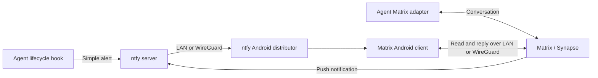

# Android notifications and chat for agentic processes

Research date: 2026-09-07. Implemented and cluster-verified: 2026-09-09.

Review convention: lines starting with `>>` are Tim's inline comments. Responses
appear immediately below as **Reply:**. The first review has been incorporated;
comments are preserved for further discussion.

## Recommendation

Matrix + ntfy/UnifiedPush is a good fit for a durable agent chat platform.
Keep Commet provisional and validate ntfy delivery first. With per-user Pocket ID
identity and long-lived workflows now explicit requirements, Matrix/Synapse is
the preferred user-facing destination. ntfy alone remains useful for simple jobs,
but its deployment is an infrastructure milestone rather than the whole solution.

The architecture should survive changes between pi, Hermes, OpenCode, or other
harnesses and local/cloud model providers. Notifications should originate from
harness lifecycle events, independently of LiteLLM and model selection.

The maintenance boundary matters: a stable notification interface requires
little glue; universal bidirectional agent control is not automatically supplied
by Matrix. Own a small set of hooks and configuration, while leaving sessions,
tool execution, and approvals to each harness's maintained adapter.

Long-lived workflows must continue within their authorized scope while the phone
is offline. Only a genuine decision requiring human input should pause the
dependent work. Notification delivery must not be a prerequisite for execution.

## Repository findings

The initial investigation inspected repository configuration and current
upstream documentation. Implementation subsequently reconciled and verified the
live cluster as recorded below.

- [Hermes](../../kubernetes/apps/llm/hermes/app/helmrelease.yaml) already runs its
  gateway/dashboard with internal Envoy routing and persistent state. Its image
  is pinned to `v2026.7.7.2`.
- [Envoy's internal gateway](../../kubernetes/apps/envoy-system/envoy/resources/internal.yaml)
  provides an HTTPS entry point.
- Cogito already has CNPG, External Secrets/1Password, and persistent-storage
  backup patterns.
- [Cluster settings](../../kubernetes/flux/meta/cluster-settings.yaml) include
  WireGuard networking. The user can access the cluster directly at home and
  through WireGuard when away.
- Existing [LLM plans](README.md) anticipate changing harnesses.
- No existing Matrix or ntfy deployment was found in the inspected manifests.

## Architecture

Matrix supplies persistent conversations, replies, rooms, and threads.
UnifiedPush supplies a delivery protocol. ntfy supplies both a server and an
Android distributor. Its built-in Matrix push gateway means this combination
does not require a separate Sygnal/common-proxies deployment.
[ntfy Matrix gateway documentation](https://docs.ntfy.sh/publish/#matrix-gateway)

These are complementary paths. A shell job can publish directly to ntfy; an
interactive agent can converse through Matrix. Avoid sending both notifications
for every event.

## Android client choice

Commet supports UnifiedPush, but its upstream tracker showed open reports of
Android notifications failing with ntfy:

- [Issue #937](https://github.com/commetchat/commet/issues/937): notifications
  failing on both Android builds, reported against v0.4.2+hotfix.1.
- [Issue #963](https://github.com/commetchat/commet/issues/963): UnifiedPush
  notifications not received, reported against v0.4.2+hotfix.2.

These are user reports, not proof that Commet will fail on Tim's phone. They
directly concern the primary requirement, however, so Commet should pass an
acceptance trial before becoming the sole notification client.

Trial Commet alongside FluffyChat, another documented UnifiedPush client. Choose
the client that passes the tests; keep the infrastructure interchangeable.
[UnifiedPush client list](https://unifiedpush.org/users/apps/)

>> I don't know much/anything about fluffychat. Are there any benefits?

**Reply:** FluffyChat is another app for the same Matrix account and rooms; it
does not require another server. Its benefits here are a simple mobile-oriented
interface, explicit UnifiedPush support, and built-in E2EE, cross-signing, and
encrypted key backups. Spaces can organize agent/project rooms. Those features
are documented by [FluffyChat](https://fluffychat.im/).

Its UnifiedPush integration has a longer documented history (listed since 2021,
versus Commet since 2023), which makes it a useful comparison client—not proof
that it is more reliable on your phone.
[UnifiedPush app list](https://unifiedpush.org/users/apps/)
I am not recommending a mandatory switch. Compare background delivery, Pocket ID
login, and the actual agent thread/reply experience, then choose. Thread handling
and approval UX need testing rather than assuming feature parity across clients.

## Alternatives

| Option | Fit for Cogito | Tradeoff |
| --- | --- | --- |
| ntfy alone | Best starting point for completion/error/attention alerts with links | Does not provide a full agent conversation interface |
| Synapse + ntfy + Matrix client | Best when replying and continuing work from Android matters | Adds database, room/account management, and encryption state |
| Gotify | Credible dedicated notification service | Little reason to prefer it when ntfy also supplies the Matrix push path |
| XMPP + Conversations | Established Android-centric messaging alternative | Agent adapters would need verification or maintenance |
| Continuwuity instead of Synapse | Worth considering if homeserver resource usage dominates | Synapse compatibility and available deployment examples are preferable for this proposal |

>> What's the difference between matrix and synapse? I'm not familiar with Synapse

**Reply:** Matrix is the open messaging protocol/ecosystem. Synapse is server
software that implements Matrix—a “homeserver” storing accounts, rooms, and
message history, serving clients, and sending push requests. Commet and FluffyChat
are client apps that connect to that server. Continuwuity is an alternative to
Synapse, not an alternative to Matrix. In this plan, “self-host Matrix” means
deploy Synapse plus its database; there is no additional product called Matrix
to install alongside Synapse.
[Synapse project](https://github.com/element-hq/synapse)

Gotify separates sending applications from receiving clients. Conversations is
an established Android XMPP client. Continuwuity positions itself as a
lightweight Matrix homeserver. The ranking above is a judgment based on Cogito's
integration and maintenance preferences.
[Gotify](https://gotify.net/docs/), [Conversations](https://conversations.im/),
[Continuwuity](https://continuwuity.org/)

## Home-ops prior art

- [TorStava's ntfy deployment](https://github.com/TorStava/home-ops/blob/main/kubernetes/apps/self-hosted/ntfy/app/helmrelease.yaml)
  uses app-template, an internal HTTPRoute, authenticated access, and persistent
  storage.
- [Jory Irving's Synapse deployment](https://github.com/joryirving/home-ops/blob/main/kubernetes/apps/base/workadventure/synapse/helmrelease.yaml)
  also uses app-template.

Adapt those patterns to Cogito's existing components. They are deployment
examples, not proof of the complete Android workflow. Their main-branch links
can change; inspect the selected revisions when implementing.

## LAN and WireGuard access

The proposed services can stay private. Use internal HTTPS names for both
services, with DNS and routes working identically on LAN and WireGuard. Public
federation and public ingress are unnecessary for private agent rooms.

Tim's WireGuard auto-enables when leaving home, triggered by the network switch.
That supports the private-service design. Transitions and outages can still delay
delivery; reconnection recovery is an acceptance requirement. Immediate delivery
while the VPN is disconnected would require a separately reachable push service.

>> My wireguard auto-enables when leaving the house (via cell switching notification). That said, there _should_ be a way for notifications to queue for delivery if the recipient is unavailable, right? That seems like a critical point of failure if not.

**Reply:** Yes. My earlier wording conflated immediate delivery with retaining
messages. A disconnected phone should cause a delay, not loss of pending work.
There are three distinct layers:

| Layer | Required behavior |
| --- | --- |
| Workflow state | Persist the run, pending decision, and result independently of the phone and notification service |
| Matrix history | Store accepted room events in Synapse; clients fetch missed history through sync/backfill after reconnecting, subject to retention and available encryption keys |
| Push delivery | Buffer accepted notifications for a bounded period and verify Android recovery after reconnecting |

Matrix's sync protocol supports catching up; that does not promise a separate
Android alert for every historical event.
[Matrix synchronization specification](https://spec.matrix.org/latest/client-server-api/#syncing)

ntfy defaults to a 12-hour in-memory cache. Configure an on-disk cache and propose
`cache-duration: 168h` (seven days) for this installation. Cached messages can be
retrieved after interruptions; the actual distributor/client replay behavior
must pass testing. A bounded cache is not an indefinite delivery queue.
[ntfy caching](https://docs.ntfy.sh/config/#message-cache),
[cached-message retrieval](https://docs.ntfy.sh/subscribe/api/#fetch-cached-messages)

If the publisher cannot reach Synapse/ntfy in the first place, those servers have
nothing to queue. Use the runner's persisted state and supported retry/outbox
mechanism for that leg. If a harness lacks this, document the gap rather than
claiming durable delivery. Pending decisions stay visible in the workflow and
can be re-announced with bounded reminders until resolved. Losing a push must
never delete a pending decision. This remains a requirement to validate, not a
capability already established for every candidate harness.

Two configuration details need explicit checks:

- The Matrix client must register the self-hosted push gateway, rather than a
  public gateway that cannot reach private ntfy endpoints.
- Synapse blocks some private outbound destinations by default. Allow the
  specific push destination through `ip_range_whitelist`, rather than disabling
  the protection broadly.
  [Synapse configuration](https://element-hq.github.io/synapse/latest/usage/configuration/config_documentation.html#ip_range_whitelist)

## Implementation plan

### 1. Deploy ntfy using existing Cogito patterns

Implementation status: live. Manifests, persistent cache/backup integration,
native credentials, topic ACLs, internal route, and metrics scraping are present
under `kubernetes/apps/observability/ntfy`. Authenticated direct publishing and
cached retrieval passed; Android acceptance remains.

Proposed location: `kubernetes/apps/observability/ntfy`.

Use app-template, `envoy-internal`, persistent auth/message-cache storage,
External Secrets, and the existing backup workflow. Configure a seven-day disk
cache. For direct alerts, start with per-user topics such as `tim-agent-events`
and `tim-agent-attention`, with explicit reader/writer ACLs. Use native API authentication rather
than an interactive PocketID proxy in front of push traffic.

For UnifiedPush, configure its separate `up*` topic permissions. Upstream
requires anonymous publishing to those endpoints; normal agent topics should
remain authenticated. Configure the Android subscriber's credentials and read
access as part of the same setup.
[ntfy access configuration](https://docs.ntfy.sh/config/#example-unifiedpush)

### 2. Prove Android delivery before adding Matrix

Install the ntfy distributor, configure the self-hosted server, and grant its
notification/background permissions.
[UnifiedPush ntfy setup](https://unifiedpush.org/users/distributors/ntfy/)

Test:

- Locked-screen delivery.
- Overnight idle.
- Wi-Fi-to-cellular transitions.
- WireGuard disconnect and reconnect.
- Phone reboot.
- Offline/reconnect behavior within the configured retention window.
- Server restart while the phone is offline: cached direct alerts survive.
- An outage longer than the push-cache window: pending workflow decisions remain
  discoverable even when the original notification has expired.
- Publisher-side outage: verify persisted retry or record the harness's gap.

A successful publish response proves server acceptance, not that the phone
alerted. Record actual phone behavior before treating the setup as reliable.

>> Do these support OCID, and in the Cogito case, Pocket ID? Ideally I'd like to have notifications scoped per Pocket ID user, if that's reasonable.

**Reply:** Assuming you mean OIDC: yes for Synapse, with an upstream-documented
Pocket ID integration. Use Pocket ID for human login, then Matrix identities and
private room membership for notification scope. A private room for Tim and the
authorized bot is the natural destination; other users get their own rooms.
SSO authenticates the person, while room membership and bot routing determine
who receives which events.
[Synapse Pocket ID integration](https://element-hq.github.io/synapse/latest/openid.html#pocket-id)

Commet/FluffyChat must successfully complete Synapse's browser-based SSO flow;
test that on the chosen Android builds. They subsequently use Matrix sessions,
so each notification does not require a new Pocket ID login. A separate Matrix
Authentication Service is not required just to use Synapse's native OIDC path.

For ntfy, the documented authentication model is local users/tokens and topic
ACLs; I did not find a supported native Pocket ID/OIDC integration. A related
[upstream authentication request](https://github.com/binwiederhier/ntfy/issues/601)
remains open. Putting an OIDC browser proxy in front does not automatically give
the Android distributor usable credentials or per-user topic permissions.

Therefore, prefer Matrix for Pocket ID-backed user-facing notifications. Let
ntfy carry device push traffic underneath it. Direct ntfy alerts can use matching
per-user accounts/topics provisioned declaratively, but that is a separate
credential lifecycle, not automatic Pocket ID synchronization. Avoid adding a
custom identity bridge just for this.

Implementation requirements: restrict the Pocket ID client to an approved group;
keep a stable OIDC identity-to-Matrix-account mapping; store the client secret via
External Secrets; use the Synapse host's
`https://matrix.<domain>/_synapse/client/oidc/callback` as the redirect URI and
the Pocket ID host as the issuer. Test two users for isolation. Account disablement
must also address existing Matrix sessions and any direct ntfy tokens—disabling
SSO alone should not be assumed to revoke all service credentials.

### 3. Add a minimal harness notification convention

Implementation status: `scripts/agent-notify.sh` implements the direct ntfy
adapter and a persistent publisher outbox. See `scripts/agent-notify.md`.

Use native hooks where available, with HTTP publishing or the established
Apprise CLI as the output mechanism. Apprise already integrates with ntfy.
[ntfy integrations](https://docs.ntfy.sh/examples/#apprise)

Standardize only the useful fields:

- Harness name.
- Stable workflow/run ID plus session ID where applicable.
- Owner/recipient mapped to an authorized Matrix room or ntfy topic.
- Event ID for retry correlation and duplicate handling.
- Event: `completed`, `failed`, `needs_input`, or an optional quiet `progress`.
- Decision ID for `needs_input`, with its status and any actual expiry.
- Short summary.
- Resume URL, when available.

Notify promptly for failures and attention requests. Make routine short
completions quiet and suppress token/tool-call chatter. Duration alone should
not determine whether an event needs attention.

Use lifecycle and approval hooks for interactive agents. A turn-completion hook
is only a source signal: it must not imply workflow completion or require a human
reply. Process exit alone also misses a long-lived agent waiting for input. An
outer job wrapper can additionally catch crashes or timeouts that the agent
cannot report itself.

>> I want to make sure that whatever is implemented is not constrained by single-turn interactions. Things like cron jobs may be reasonable here, but for long-lived, built-by-agent workflows that only require human input once every few hours, I don't want to block those on user interactions for every single decision.

**Reply:** Agreed. The unit of work is a persistent workflow, which may span many
agent turns and hours or days. Matrix is its communication interface; ntfy is
its alert delivery. Neither should impose a turn-by-turn approval loop.

The runner should continue already-authorized actions autonomously. It should
pause only the work dependent on an actual human decision, retaining its state
until the answer arrives. Independent work may continue. No phone connection,
push acknowledgment, or read receipt should be required for ordinary progress.
Silence is not approval for an action that actually requires approval.

Example: an agent processes a batch for four hours, checkpoints progress, asks
one question about an ambiguous item, and continues independent items. Tim
reconnects later and answers that decision; the runner validates that it is still
pending and resumes the affected work. It sends one completion event when the
workflow is finished, rather than one per model turn.

Use the chosen harness's maintained background execution, persistence, and
resume facilities. Cron can trigger scheduled work, but does not by itself
provide checkpointing or resumable approvals. Verify restart recovery, reply
correlation, and stale/duplicate reply handling for each adapter. A notification
hook cannot supply those capabilities to a harness that lacks them; do not build
a new general workflow engine as part of this notification deployment.

### 4. Add a small Synapse deployment if mobile conversation is wanted

Implementation status: live. Synapse, three-instance CNPG, Pocket ID, the
internal route, persistent state/backup, and metrics are deployed from
`kubernetes/apps/home-infra/matrix`. Health, the client versions API, Pocket ID
SSO discovery, database encoding/locale, and HTTPS routing passed. Android
acceptance remains.

>> Again, what's the difference between synapse and matrix? I'm peripherally familiar with Matrix, but no clue what Synapse is.

**Reply:** This step installs the Matrix server implementation: Synapse. Matrix
is the protocol, Synapse runs in Cogito, and Commet/FluffyChat runs on the phone.
The explanation above is now explicit, and this step also includes Pocket ID
login because per-user identity is a requirement.

Proposed location: `kubernetes/apps/home-infra/matrix`.

Use app-template, CNPG, persistent media storage, and backed-up signing keys.
Start with one Synapse process, private rooms, closed registration, and federation
disabled. Choose the permanent Matrix server name before creating accounts.
Configure native Synapse OIDC with Pocket ID and approved-user provisioning;
closed registration means no unrestricted signup, not disabling intended SSO
account creation. Use private per-user/project rooms and explicit bot routing.

Check the CNPG configuration against Synapse's database requirements: UTF-8
encoding with `C` collation/ctype.
[Synapse PostgreSQL instructions](https://element-hq.github.io/synapse/latest/postgres.html)

### 5. Connect the current harness through its maintained Matrix adapter

Implementation status: live for Hermes. The non-admin
`@hermes:matrix.${DOMAIN_NAME}` account uses a 1Password-backed credential,
required E2EE, persistent crypto state, a stable device ID, and a strict Tim-only
user allowlist. Hermes reports the Matrix platform connected. A permanent room
allowlist and proactive home room wait on phone-side room creation.

Current Hermes documentation describes native Matrix support, including threads,
approvals, and configurable E2EE. Cogito pins `v2026.7.7.2`; verify those
capabilities in that image before adopting current configuration examples.
[Hermes Matrix documentation](https://hermes-agent.nousresearch.com/docs/user-guide/messaging/matrix)

Give each harness its own bot identity and restrict allowed users/rooms. Persist
bot encryption state when using encrypted rooms.

For harnesses without a maintained Matrix adapter, retain ntfy alerts with links
to their UI. That preserves useful functionality without commissioning a
universal bridge. Switching harnesses preserves the notification service and
chat infrastructure, but does not automatically transfer execution sessions or
approval semantics.

### 6. Accept the complete workflow on the phone

Test Commet and FluffyChat with completion messages, threaded replies, encrypted
messages, and attention requests. Verify the registered pusher URL, background
delivery, reconnect behavior, and actual reply routing.

Include a multi-hour workflow with the phone offline, a persisted pending
decision, and a runner restart. Confirm authorized work continues, the decision
survives, and an authenticated reply resumes only the intended pending work.
Verify duplicate/stale replies cannot execute an action twice. Also test Pocket
ID login and two-user room/topic isolation. These are acceptance criteria for the
selected harness integration, not promises about every harness.

Keep approvals in the harness's authenticated workflow unless its native Matrix
adapter explicitly supports them.

## Requirements confirmed in review

- WireGuard auto-enables away from home; temporary gaps require recovery.
- Pending work must survive notification outages and phone disconnection.
- Notifications should be scoped per user, with Pocket ID identity preferred.
- Workflows can span many turns and hours; routine decisions must not introduce
  additional human approval gates.

## Plan review and implementation queue

Implementation status: the GitHub and Pi path is implemented locally. Plan-only
pull requests under `plans/review/` are governed by
`.github/workflows/plan-review.yaml`. The workflow ties approval to the exact
head SHA, revokes it after any revision, and exposes approved work through
repository labels. Pi's `deliver-approved-plan` profile verifies that approval,
claims the request, implements it in an isolated jj workspace, reviews it, opens
an implementation pull request, and stops at the merge boundary.

The intended interaction is:

1. A planning agent opens a draft pull request changing one
   `plans/review/*.md` file.
2. Tim reviews Markdown through GitHub's rendered view and line-comment review
   threads. The planning agent responds and pushes revisions.
3. Tim marks the pull request ready and applies `workflow/plan-approved`.
4. The GitHub workflow attests the exact SHA and adds
   `workflow/implementation-queued`.
5. A compatible runner claims the request. For Pi, run
   `/workflow start deliver-approved-plan <PR number or URL>` from the Cogito
   root. No second plan or mutation approval is requested.
6. Pi uses `worker`, then `reviewer`, permits one bounded repair, opens a second
   pull request, waits for checks, marks the plan complete, and waits at its
   existing merge boundary.

This is deliberately pull-based today. A future always-on coordinator can poll
the same label without changing the plan format or execution roles. Polling is
also compatible with private cluster access; GitHub-hosted Actions cannot call
the private Matrix homeserver, and GitHub cannot deliver Hookshot webhooks to an
internal-only route.

Use one queue dispatcher per repository. GitHub labels do not provide an atomic
claim operation, so allowing Pi, Hermes, and OpenCode to poll independently
could start duplicate runs. The dispatcher can route each claimed request to
whichever harness and LiteLLM role is current.

Matrix Hookshot remains the preferred established bridge when a suitable
inbound webhook path exists. It can mirror GitHub pull request, review, comment,
label, and workflow events into `#project-cogito`. GitHub remains authoritative:
Hookshot is a notification bridge, not a transactional queue, and its GitHub
connection does not promise that every event for one pull request will land in
one Matrix thread. Exact automatic per-plan threads would require a small
adapter or an upstream Hookshot feature, so it is deferred until that extra
maintenance is justified.

### LiteLLM roles in this flow

The LiteLLM entries are not redundant. They are model aliases plus scoped keys,
rate limits, and cost boundaries. Pi supplies the durable workflow and creates
actual child-agent processes; GitHub supplies review and queue state; Matrix
supplies conversation and notification delivery.

| Current name | Meaning in this flow | Disposition |
| --- | --- | --- |
| `coordinator` | Long-lived harness seat that chooses work and delegates | Keep; correctly named as a role, though it is not a daemon by itself |
| `coordinator-heavy` | Explicit higher-cost coordinator choice | Keep as an exceptional seat |
| `worker` | Local Qwen implementation seat | Keep; used by `deliver-approved-plan` |
| `reviewer` | Local Qwen read-only review seat with different prompting/reasoning | Keep; separate role even though it currently shares the worker backend |
| `worker-escalated` | Cloud implementation fallback after demonstrated local failure | Keep; the coordinator selects it, not the queue |
| `reviewer-escalated` | Paid, different-family review/council fallback | Keep; valuable specifically because it is independent of local Qwen |
| cost accounting | LiteLLM budgets, spend attribution, and dashboards | Keep as policy/telemetry; there is no separate `cost` agent in the current configuration |

Calling these all “agents” can imply that LiteLLM runs autonomous workers. It
does not. “Execution roles” or “model seats” is more precise in documentation;
the existing alias names themselves are useful and do not need migration.

## Live validation

On 2026-09-09, Flux applied the implementation to Cogito. ntfy and Synapse Helm
releases became Ready; both internal HTTPS health endpoints returned success.
The Matrix CNPG cluster reached three of three healthy instances, and its `app`
database reported `UTF8|C|C`. Synapse advertised Pocket ID SSO and password login
for explicitly provisioned service accounts. Hermes reported its Matrix platform
`connected`. A direct ntfy event published through `scripts/agent-notify.sh` was
then read back from the cache with the expected event and workflow identifiers.

## Decisions remaining after implementation

- Is the proposed seven-day push cache sufficient for expected offline periods?
- Which Android device/build will be used for acceptance testing?
- Should Commet remain the preferred client subject to passing the trial?
- What should alert audibly versus quietly, especially for short successful runs?
- Which private room should become Hermes' `MATRIX_HOME_ROOM` and initial
  `MATRIX_ALLOWED_ROOMS` entry?

These decisions refine the implementation; none requires building a new general
agent backend or notification platform.
